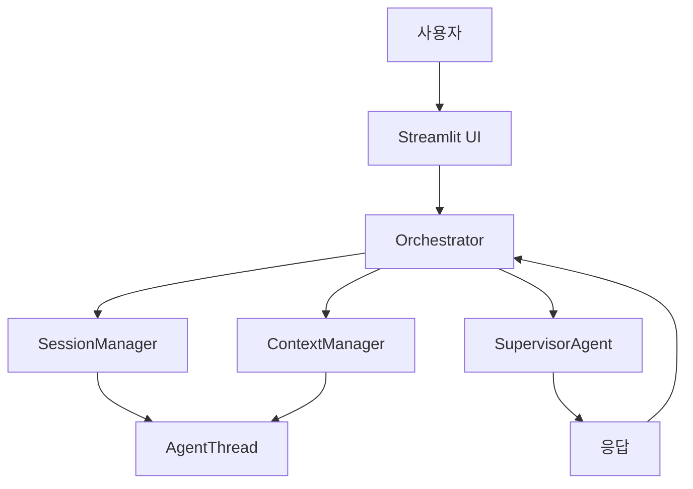
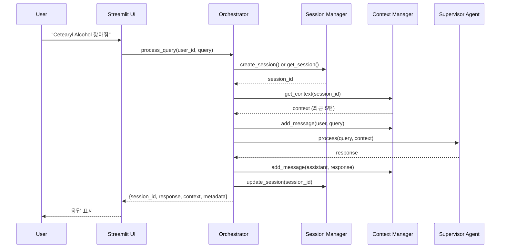

# Orchestrator 설계

전체 시스템의 진입점으로 세션 관리, 대화 컨텍스트 유지, Supervisor 호출을 통합합니다.

---

## 개요

Orchestrator는 사용자 요청을 받아 세션을 관리하고, 대화 컨텍스트를 유지하며, SupervisorAgent를 호출하여 응답을 반환하는 최상위 계층입니다.

### 주요 책임

- **세션 관리**: SessionManager를 통한 세션 생성/조회/갱신
- **컨텍스트 관리**: ContextManager를 통한 대화 히스토리 유지
- **플로우 통합**: Supervisor 호출 및 응답 처리

---

## 아키텍처

### 전체 플로우



### 처리 단계

1. 세션 ID 확인 (없으면 새로 생성)
2. 사용자 메시지를 컨텍스트에 추가
3. 대화 컨텍스트 조회
4. Supervisor에 전달
5. 응답을 컨텍스트에 저장
6. 결과 반환

---

## 주요 컴포넌트

### 1. Orchestrator

전체 플로우를 통합하는 메인 클래스입니다.

**주요 메서드**:
- `process_query(user_id, query, session_id=None)`: 쿼리 처리
- `clear_session(session_id)`: 세션 초기화
- `create_default(chat_client)`: 기본 인스턴스 생성 (팩토리 메서드)

**반환 형식**:
```python
{
    "session_id": str,
    "response": {
        "content": str,
        "worker": str,
        "timestamp": datetime,
        "metadata": dict
    }
}
```

---

### 2. SessionManager

AgentThread 기반 세션 관리를 담당합니다.

**특징**:
- Microsoft Agent Framework의 AgentThread 활용
- In-memory 저장 (프로토타입)
- TTL 30분 (자동 만료)

**주요 메서드**:
- `create_session(user_id)`: 새 세션 생성
- `get_session(session_id)`: 세션 조회
- `update_session(session_id)`: 세션 갱신 (TTL 연장)
- `delete_session(session_id)`: 세션 삭제
- `cleanup_expired_sessions()`: 만료된 세션 정리

**데이터 구조**:
```python
{
    "user_id": str,
    "thread": AgentThread,
    "created_at": datetime,
    "updated_at": datetime
}
```

---

### 3. ContextManager

대화 컨텍스트(히스토리)를 관리합니다.

**특징**:
- AgentThread의 message_store 활용
- 토큰 기반 컨텍스트 윈도우 관리
- 최근 대화 우선 유지 (max_turns 제한)

**주요 메서드**:
- `add_message(session_id, role, content)`: 메시지 추가
- `get_context(session_id)`: 컨텍스트 조회
- `clear_context(session_id)`: 컨텍스트 초기화

**토큰 관리**:
- tiktoken 라이브러리 사용
- 기본 max_turns=5 (최근 5턴 유지)
- 토큰 초과 시 오래된 메시지부터 제거

---

## Streamlit UI

웹 기반 채팅 인터페이스를 제공합니다.

### 주요 기능

- **채팅 인터페이스**: 사용자-AI 대화
- **세션 관리**: 새 대화 시작 버튼
- **샘플 질의**: 3개 예시 질문 제공
- **디버깅 정보**: Worker 정보, 응답 시간 표시
- **대화 히스토리**: 이전 대화 표시

### UI 구성

- **메인 영역**: 채팅 메시지 표시
- **사이드바**: 새 대화, 샘플 질의, 설정
- **입력창**: 사용자 질문 입력

---

## 환경 설정

필수 환경변수:
- `AZURE_OPENAI_ENDPOINT`
- `AZURE_OPENAI_API_KEY`
- `AZURE_OPENAI_DEPLOYMENT_NAME`
- `AZURE_OPENAI_RESPONSES_DEPLOYMENT_NAME`
- `AZURE_SEARCH_ENDPOINT` (선택)
- `AZURE_SEARCH_API_KEY` (선택)
- `USE_MOCK_SEARCH` (기본값: true)
        Args:
            session_id: 세션 ID
        
        Returns:
            세션 정보 또는 None
        """
        # 만료된 세션 확인
        if session_id in self.sessions:
            session = self.sessions[session_id]
            if datetime.now() - session["updated_at"] > self.ttl:
                self.delete_session(session_id)
                return None
            return session
        return None
    
    def update_session(self, session_id: str):
        """세션 타임스탬프 업데이트"""
        if session_id in self.sessions:
            self.sessions[session_id]["updated_at"] = datetime.now()
    
    def delete_session(self, session_id: str):
        """세션 삭제"""
        if session_id in self.sessions:
            del self.sessions[session_id]
    
    def cleanup_expired_sessions(self):
        """만료된 세션 정리"""
        now = datetime.now()
        expired = [
            sid for sid, session in self.sessions.items()
            if now - session["updated_at"] > self.ttl
        ]
        for sid in expired:
            self.delete_session(sid)
```

---

### 3. Context Manager (context_manager.py)

대화 컨텍스트를 관리합니다.

```python
from typing import List, Dict, Optional
from collections import deque

class ContextManager:
    """대화 컨텍스트 관리"""
    
    def __init__(self, max_turns: int = 5):
        """
        Args:
            max_turns: 유지할 최대 대화 턴 수
        """
        self.contexts: Dict[str, deque] = {}  # {session_id: deque([messages])}
        self.max_turns = max_turns
    
    def add_message(
        self, 
        session_id: str, 
        role: str, 
        content: str,
        metadata: Optional[Dict] = None
    ):
        """
        대화 메시지를 추가합니다.
        
        Args:
            session_id: 세션 ID
            role: "user" 또는 "assistant"
            content: 메시지 내용
            metadata: 추가 메타데이터 (선택)
        """
        if session_id not in self.contexts:
            self.contexts[session_id] = deque(maxlen=self.max_turns * 2)  # user + assistant
        
        message = {
            "role": role,
            "content": content,
            "metadata": metadata or {}
        }
        
        self.contexts[session_id].append(message)
    
    def get_context(self, session_id: str) -> List[Dict]:
        """
        세션의 대화 컨텍스트를 반환합니다.
        
        Args:
            session_id: 세션 ID
        
        Returns:
            메시지 리스트
        """
        if session_id not in self.contexts:
            return []
        return list(self.contexts[session_id])
    
    def clear_context(self, session_id: str):
        """세션의 컨텍스트를 초기화합니다."""
        if session_id in self.contexts:
            del self.contexts[session_id]
    
    def get_last_n_messages(self, session_id: str, n: int) -> List[Dict]:
        """최근 N개의 메시지를 반환합니다."""
        context = self.get_context(session_id)
        return context[-n:] if context else []
```

---

### 4. 데이터 모델 (models.py)

```python
from pydantic import BaseModel, Field
from typing import Optional, List, Dict, Any
from datetime import datetime

class Message(BaseModel):
    """대화 메시지"""
    role: str = Field(..., description="user 또는 assistant")
    content: str = Field(..., description="메시지 내용")
    timestamp: datetime = Field(default_factory=datetime.now)
    metadata: Dict[str, Any] = Field(default_factory=dict)

class Session(BaseModel):
    """세션 정보"""
    session_id: str
    user_id: str
    created_at: datetime
    updated_at: datetime
    context: List[Message] = Field(default_factory=list)

class QueryRequest(BaseModel):
    """쿼리 요청"""
    user_id: str
    query: str
    session_id: Optional[str] = None

class QueryResponse(BaseModel):
    """쿼리 응답"""
    session_id: str
    response: str
    context: List[Message]
    metadata: Dict[str, Any] = Field(default_factory=dict)
```

---

## 🎨 Streamlit Web UI

### UI 구조 (ui/web.py)

```python
import streamlit as st
import asyncio
from orchestrator import Orchestrator

# 페이지 설정
st.set_page_config(
    page_title="화장품 R&D 검색 Assistant",
    page_icon="🧴",
    layout="wide"
)

# 제목
st.title("🧴 화장품 R&D 검색 Assistant")
st.markdown("원료, 처방, 규제 정보를 검색해보세요")

# 세션 상태 초기화
if "session_id" not in st.session_state:
    st.session_state.session_id = None
if "messages" not in st.session_state:
    st.session_state.messages = []
if "orchestrator" not in st.session_state:
    # Orchestrator 초기화 (실제 구현 시 설정 필요)
    st.session_state.orchestrator = initialize_orchestrator()

# 사이드바
with st.sidebar:
    st.header("설정")
    user_id = st.text_input("사용자 ID", value="test_user")
    
    if st.button("대화 초기화"):
        if st.session_state.session_id:
            st.session_state.orchestrator.clear_session(st.session_state.session_id)
        st.session_state.session_id = None
        st.session_state.messages = []
        st.rerun()
    
    st.divider()
    st.markdown("### 샘플 질의")
    if st.button("Cetearyl Alcohol 원료 찾기"):
        st.session_state.sample_query = "Cetearyl Alcohol 원료 찾아줘"
    if st.button("발주완료 원료 목록"):
        st.session_state.sample_query = "발주완료된 원료 목록 보여줘"
    if st.button("글리세린 CAS 번호"):
        st.session_state.sample_query = "글리세린의 CAS 번호는?"

# 대화 히스토리 표시
for message in st.session_state.messages:
    with st.chat_message(message["role"]):
        st.markdown(message["content"])
        if message.get("metadata"):
            with st.expander("메타데이터"):
                st.json(message["metadata"])

# 사용자 입력
if prompt := st.chat_input("질문을 입력하세요") or st.session_state.get("sample_query"):
    if st.session_state.get("sample_query"):
        prompt = st.session_state.sample_query
        del st.session_state.sample_query
    
    # 사용자 메시지 표시
    st.session_state.messages.append({"role": "user", "content": prompt})
    with st.chat_message("user"):
        st.markdown(prompt)
    
    # Assistant 응답 생성
    with st.chat_message("assistant"):
        message_placeholder = st.empty()
        
        # Orchestrator 호출
        with st.spinner("검색 중..."):
            response = asyncio.run(
                st.session_state.orchestrator.process_query(
                    user_id=user_id,
                    query=prompt,
                    session_id=st.session_state.session_id
                )
            )
        
        # 세션 ID 저장
        st.session_state.session_id = response["session_id"]
        
        # 응답 표시
        message_placeholder.markdown(response["response"])
        
        # 메타데이터 표시
        if response.get("metadata"):
            with st.expander("메타데이터"):
                st.json(response["metadata"])
        
        # 메시지 저장
        st.session_state.messages.append({
            "role": "assistant",
            "content": response["response"],
            "metadata": response.get("metadata")
        })

def initialize_orchestrator():
    """Orchestrator 초기화 (실제 구현 필요)"""
    # TODO: SessionManager, ContextManager, Supervisor Agent 초기화
    pass
```

---

## 📊 실행 흐름

### 단일 쿼리 처리



---

## 🛠️ 구현 체크리스트

### Day 2-3: 기본 구조

- [ ] `orchestrator.py` 기본 구조 작성
- [ ] `session_manager.py` 구현
- [ ] `context_manager.py` 구현
- [ ] `models.py` 데이터 모델 정의
- [ ] Streamlit UI 기본 레이아웃

### Day 4: 통합

- [ ] Supervisor Agent 연동
- [ ] 비동기 처리 구현
- [ ] 에러 핸들링
- [ ] 로깅 추가

### Day 5-7: UI 고도화

- [ ] 대화 히스토리 표시
- [ ] 샘플 질의 버튼
- [ ] 메타데이터 표시
- [ ] 세션 초기화 기능
- [ ] UX 개선 (로딩 스피너, 에러 메시지)

---

## 🧪 테스트 시나리오

### 단위 테스트

```python
# tests/test_orchestrator.py
import pytest
from orchestrator import Orchestrator, SessionManager, ContextManager

@pytest.fixture
def orchestrator():
    sm = SessionManager(ttl_minutes=30)
    cm = ContextManager(max_turns=5)
    sup = MockSupervisor()  # Mock
    return Orchestrator(sm, cm, sup)

def test_create_new_session(orchestrator):
    result = await orchestrator.process_query(
        user_id="test_user",
        query="테스트 질의"
    )
    assert result["session_id"] is not None
    assert len(result["response"]) > 0

def test_reuse_session(orchestrator):
    result1 = await orchestrator.process_query(
        user_id="test_user",
        query="첫 번째 질의"
    )
    session_id = result1["session_id"]
    
    result2 = await orchestrator.process_query(
        user_id="test_user",
        query="두 번째 질의",
        session_id=session_id
    )
    
    assert result2["session_id"] == session_id
    assert len(result2["context"]) == 4  # user1, assistant1, user2, assistant2
```

---

## � 시작하기

### 1. 패키지 설치 (uv 사용)

```bash
# uv가 없다면 설치
curl -LsSf https://astral.sh/uv/install.sh | sh

# 프로젝트 의존성 설치
uv sync

# 또는 개별 패키지 추가
uv add azure-openai streamlit pydantic
```

### 2. 환경 변수 설정

`.env` 파일을 생성하고 아래 내용을 추가합니다:

```bash
# Orchestrator 설정
SESSION_TTL_MINUTES=30
MAX_CONTEXT_TURNS=5

# Streamlit 설정
STREAMLIT_SERVER_PORT=8501
STREAMLIT_SERVER_ADDRESS=localhost
```

### 3. 실행

```bash
# uv를 사용하여 Streamlit 실행
uv run streamlit run src/ui/web.py

# 또는 직접 Python 실행
uv run python -m streamlit run src/ui/web.py
```

---

## �📝 환경 변수 (.env)

```bash
# Orchestrator 설정
SESSION_TTL_MINUTES=30
MAX_CONTEXT_TURNS=5

# Streamlit 설정
STREAMLIT_SERVER_PORT=8501
STREAMLIT_SERVER_ADDRESS=localhost
```

---

## 🎯 성공 기준

- ✅ 세션 생성 및 유지 (30분 TTL)
- ✅ 대화 컨텍스트 관리 (최근 5턴)
- ✅ Supervisor Agent 비동기 호출
- ✅ Streamlit UI 동작
- ✅ 에러 핸들링 및 로깅

---

**문서 버전**: 1.0  
**작성일**: 2025-12-08  
**담당**: 개발자 A
