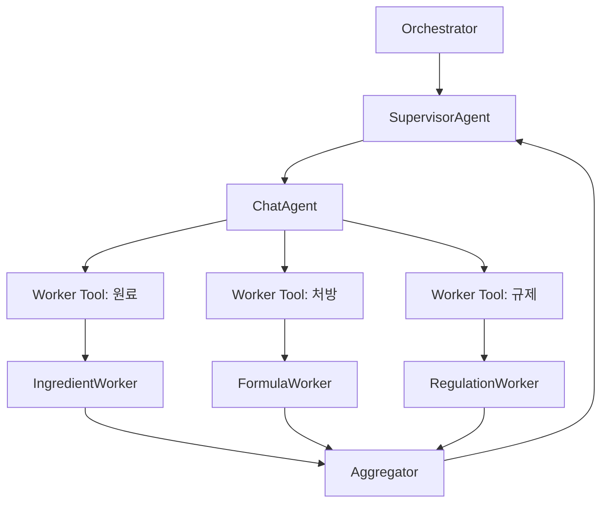
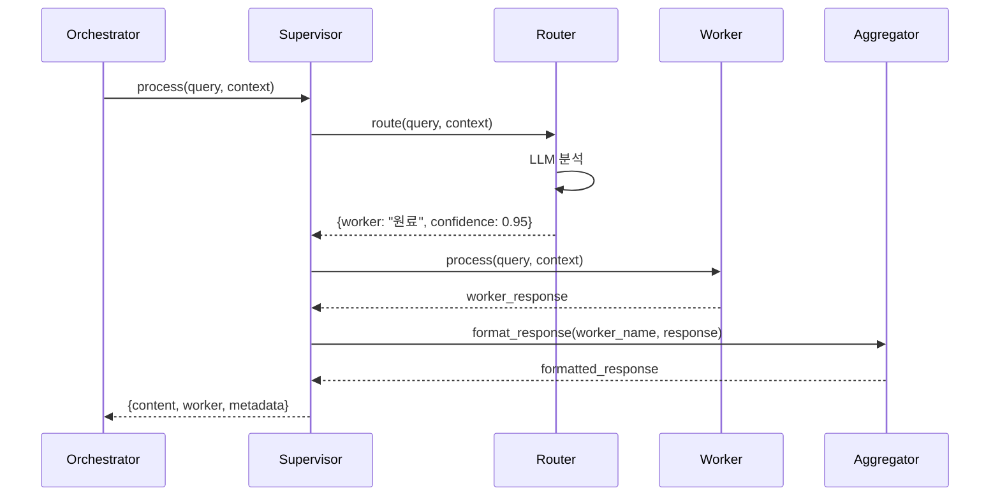

# Supervisor Agent 설계

Agent-as-Tool 패턴으로 Worker를 자동 선택하고 응답을 통합합니다.

---

## 개요

SupervisorAgent는 사용자 질의를 분석하여 적절한 Worker Agent를 자동으로 선택하고 호출합니다. 별도의 Router 없이 ChatAgent가 Tool로 등록된 Worker를 직접 선택합니다.

### 핵심 특징

- **Agent-as-Tool 패턴**: Worker를 Tool로 래핑하여 ChatAgent에 등록
- **자동 라우팅**: LLM이 질의 분석 후 적절한 Worker Tool 선택
- **응답 통합**: Aggregator를 통한 일관된 응답 포맷

---

## 아키텍처

### Agent-as-Tool 패턴



### 처리 플로우

1. 사용자 질의를 ChatAgent에 전달
2. ChatAgent가 적절한 Worker Tool 선택
3. Worker가 검색 수행
4. Aggregator가 응답 포맷팅
5. 최종 응답 반환

---

## 주요 컴포넌트

### 1. SupervisorAgent

Worker를 Tool로 관리하는 메인 클래스입니다.

**초기화**:
- Worker 딕셔너리를 받아 Tool로 변환
- ChatAgent 생성 시 Worker Tools 등록

**주요 메서드**:
- `process(query, context, session_id)`: 쿼리 처리

**반환 형식**:

```python
{
    "content": str,           # 포맷팅된 최종 응답
    "worker": str,            # 사용된 Worker 이름
    "timestamp": datetime,
    "metadata": dict          # tool_calls 등 추가 정보
}
```

---

### 2. Worker Tools (worker_tools.py)

Worker를 Tool로 변환하는 모듈입니다.

**주요 함수**:
- `create_worker_tools(workers)`: Worker 딕셔너리를 Tool 리스트로 변환

**Tool 래핑**:
- 각 Worker의 `process()` 메서드를 Tool 함수로 래핑
- Function calling 스키마 자동 생성
- Annotated + Field로 파라미터 설명 추가

---

### 3. Aggregator (aggregator.py)

Worker 응답을 사용자 친화적으로 포맷팅합니다.

**주요 메서드**:
- `format_response(worker_name, worker_response)`: 응답 포맷팅

**포맷 구조**:
- Worker 응답 내용
- 출처 정보 (최대 3개)
- Worker 정보 (일반 대화 제외)

**출처 표시**:

```text
📌 출처:
- 문서1
- 문서2
- 문서3
```

---

## 시스템 프롬프트

### Supervisor Instructions

SupervisorAgent의 역할을 정의합니다:

- 사용자 질의 분석
- 적절한 Worker Tool 선택
- 검색이 불필요한 경우 직접 응답
- 친절하고 명확한 답변 제공

**Tool 선택 기준**:
- 원료 관련: search_ingredient
- 처방 관련: search_formula (향후)
- 규제 관련: search_regulation (향후)
- 일반 대화: Tool 미사용

---

## Worker 등록

현재 구현된 Worker:
- **IngredientWorker**: 원료 검색

향후 추가 예정:
- **FormulaWorker**: 처방 검색
- **RegulationWorker**: 규제 검색

새로운 Worker 추가 방법:

1. BaseWorker 상속하여 Worker 클래스 구현
2. Orchestrator 생성 시 workers 딕셔너리에 추가
3. 자동으로 Tool로 변환되어 ChatAgent에 등록

---

## 에러 처리

- Worker 호출 실패 시 사용자 친화적 메시지 반환
- Tool 선택 오류 시 "일반" Worker로 분류
- 타임아웃 처리 (Worker 레벨)
{{
  "worker": "원료" | "처방" | "규제",
  "confidence": 0.0 ~ 1.0,
  "reasoning": "선택 이유"
}}
"""
        
        # LLM 호출
        response = await self.agent.complete(prompt)
        
        # JSON 파싱
        import json
        try:
            result = json.loads(response)
            return result
        except json.JSONDecodeError:
            # 파싱 실패 시 기본값
            return {
                "worker": "원료",  # 기본값
                "confidence": 0.5,
                "reasoning": "파싱 실패, 기본 Worker 선택"
            }
    
    def _format_context(self, context: List[Dict]) -> str:
        """컨텍스트를 문자열로 포맷팅"""
        if not context:
            return "없음"
        
        lines = []
        for msg in context[-3:]:  # 최근 3개만
            role = "사용자" if msg["role"] == "user" else "Assistant"
            lines.append(f"{role}: {msg['content']}")
        return "\n".join(lines)
```

---

### 3. Aggregator (aggregator.py)

Worker의 응답을 통합하고 포맷팅합니다.

```python
from typing import Dict, Any

class Aggregator:
    """Worker 응답을 통합하고 포맷팅"""
    
    def format_response(
        self,
        worker_name: str,
        worker_response: Dict[str, Any],
        query: str
    ) -> str:
        """
        Worker 응답을 사용자 친화적으로 포맷팅합니다.
        
        Args:
            worker_name: Worker 이름
            worker_response: Worker 응답
            query: 원본 질의
        
        Returns:
            포맷팅된 응답 문자열
        """
        content = worker_response.get("content", "")
        sources = worker_response.get("sources", [])
        
        # 기본 응답
        formatted = content
        
        # 출처 정보 추가
        if sources:
            formatted += "\n\n📚 **참고 문서**:\n"
            for i, source in enumerate(sources[:3], 1):  # 최대 3개
                formatted += f"{i}. {source.get('title', 'Unknown')} "
                if source.get("url"):
                    formatted += f"([링크]({source['url']}))"
                formatted += "\n"
        
        # Worker 정보 추가 (디버깅용)
        formatted += f"\n\n_🤖 {worker_name} Agent가 응답했습니다._"
        
        return formatted
    
    def combine_multiple_responses(
        self,
        responses: List[Dict[str, Any]]
    ) -> str:
        """
        여러 Worker의 응답을 통합합니다. (향후 멀티홉 쿼리용)
        
        Args:
            responses: Worker 응답 리스트
        
        Returns:
            통합된 응답
        """
        # TODO: 멀티홉 쿼리 지원 시 구현
        pass
```

---

### 4. 시스템 프롬프트 (prompts.py)

```python
SUPERVISOR_INSTRUCTIONS = """
당신은 화장품 R&D 검색 시스템의 Supervisor Agent입니다.

[역할]
- 사용자 질의를 분석하여 적절한 Worker Agent로 라우팅
- Worker의 응답을 통합하여 최종 답변 생성
- 일관되고 정확한 정보 제공

[원칙]
- 명확하지 않은 질의는 사용자에게 재확인 요청
- Worker의 응답을 있는 그대로 전달 (왜곡 금지)
- 출처 정보를 반드시 포함
"""

ROUTER_INSTRUCTIONS = """
당신은 사용자 질의를 분석하여 적절한 Worker Agent를 선택하는 Router입니다.

[Worker 종류]
1. **원료**: 원료 정보, 성분, CAS 번호, 발주 상태, 스펙 등
2. **처방**: 처방 정보, 원료 구성, 함량, 처방 이력 등
3. **규제**: 국가별 규제, 허용 함량, 금지 성분, 인증 요건 등

[분류 기준]
- 키워드: "원료", "성분", "CAS" → 원료
- 키워드: "처방", "포뮬라", "구성", "함량" → 처방
- 키워드: "규제", "국가", "허용", "금지", "인증" → 규제
- 애매한 경우: 대화 컨텍스트를 참고하여 판단

[출력 형식]
반드시 JSON 형식으로 응답:
{
  "worker": "원료" | "처방" | "규제",
  "confidence": 0.0 ~ 1.0,
  "reasoning": "선택 이유를 한 문장으로"
}
"""
```

---

### 5. 데이터 모델 (models.py)

```python
from pydantic import BaseModel, Field
from typing import List, Dict, Any, Optional
from datetime import datetime

class RoutingResult(BaseModel):
    """라우팅 결과"""
    worker: str = Field(..., description="선택된 Worker (원료/처방/규제)")
    confidence: float = Field(..., ge=0.0, le=1.0, description="신뢰도")
    reasoning: str = Field(..., description="선택 이유")

class WorkerResponse(BaseModel):
    """Worker 응답"""
    content: str = Field(..., description="응답 내용")
    sources: List[Dict[str, str]] = Field(default_factory=list, description="참고 문서")
    timestamp: datetime = Field(default_factory=datetime.now)
    metadata: Dict[str, Any] = Field(default_factory=dict)

class SupervisorResponse(BaseModel):
    """Supervisor 최종 응답"""
    content: str = Field(..., description="최종 응답")
    worker: str = Field(..., description="사용된 Worker")
    timestamp: datetime = Field(default_factory=datetime.now)
    metadata: Dict[str, Any] = Field(default_factory=dict)
```

---

## 📊 실행 흐름

### 쿼리 처리 흐름



---

## 🛠️ 구현 체크리스트

### Day 2-3: 기본 구조

- [ ] `supervisor.py` 기본 구조 작성
- [ ] `router.py` 구현
- [ ] `aggregator.py` 구현
- [ ] `prompts.py` 시스템 프롬프트 작성
- [ ] `models.py` 데이터 모델 정의

### Day 4: Worker 연동

- [ ] Worker Agent 인터페이스 정의
- [ ] 원료 Worker 연동 테스트
- [ ] 에러 핸들링

### Day 6: 고도화

- [ ] 라우팅 정확도 개선
- [ ] 응답 포맷 개선
- [ ] 로깅 추가

---

## 🧪 테스트 시나리오

### 단위 테스트

```python
# tests/test_supervisor.py
import pytest
from supervisor import SupervisorAgent, Router, Aggregator

@pytest.fixture
def supervisor():
    router = Router(chat_client)
    aggregator = Aggregator()
    workers = {"원료": MockIngredientWorker()}
    return SupervisorAgent(chat_client, router, aggregator, workers)

@pytest.mark.asyncio
async def test_route_to_ingredient_worker(supervisor):
    result = await supervisor.process(
        query="Cetearyl Alcohol 원료 찾아줘",
        context=[],
        session_id="test"
    )
    
    assert result["worker"] == "원료"
    assert len(result["content"]) > 0
    assert "Cetearyl Alcohol" in result["content"]

@pytest.mark.asyncio
async def test_context_aware_routing(supervisor):
    context = [
        {"role": "user", "content": "글리세린 정보 알려줘"},
        {"role": "assistant", "content": "글리세린(Glycerin)은..."}
    ]
    
    result = await supervisor.process(
        query="이 원료의 CAS 번호는?",
        context=context,
        session_id="test"
    )
    
    assert result["worker"] == "원료"
```

---

## � 시작하기

### 1. 패키지 설치 (uv 사용)

```bash
# 프로젝트 의존성 설치
uv sync

# 또는 Supervisor 관련 패키지만 추가
uv add azure-openai pydantic
```

### 2. 환경 변수 설정

```bash
# Supervisor 설정
ROUTING_CONFIDENCE_THRESHOLD=0.7
DEFAULT_WORKER=원료
```

### 3. 테스트

```bash
# pytest를 사용한 단위 테스트
uv run pytest tests/test_supervisor.py -v

# 개별 함수 테스트
uv run python -c "from src.supervisor.router import Router; print(Router().route('원료 검색'))"
```

---

## �📝 환경 변수 (.env)

```bash
# Supervisor 설정
ROUTING_CONFIDENCE_THRESHOLD=0.7
DEFAULT_WORKER=원료
```

---

## 🎯 성공 기준

- ✅ 라우팅 정확도 > 90% (수동 평가)
- ✅ Worker 호출 성공
- ✅ 응답 포맷팅 일관성
- ✅ 에러 핸들링

---

**문서 버전**: 1.0  
**작성일**: 2025-12-08  
**담당**: 개발자 B
