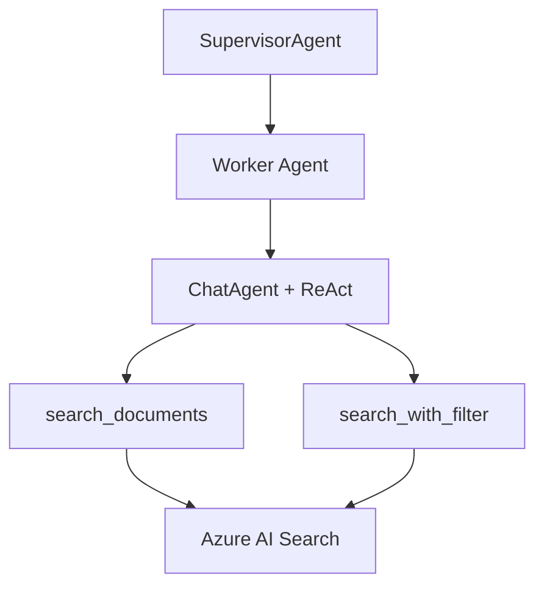

# Worker Agent 설계

도메인별 검색 Agent를 ReAct 패턴으로 구현합니다.

---

## 개요

Worker Agent는 특정 도메인(원료, 처방, 규제)에 대한 검색 및 데이터 조회를 담당합니다. Microsoft Agent Framework의 ChatAgent와 ReAct 패턴을 사용하여 자율적으로 Tool을 선택하고 실행합니다.

### 핵심 특징

- **ReAct 패턴**: 추론(Reasoning) → 행동(Acting) → 관찰(Observing) 반복
- **자율적 Tool 선택**: Agent가 상황에 맞는 검색 Tool 선택
- **공통 Tool 재사용**: 모든 Worker가 동일한 검색 Tool 사용

---

## 아키텍처

### Worker 구조



### ReAct 패턴 플로우

1. **Reasoning**: 질의 분석 및 검색 전략 수립
2. **Acting**: 적절한 Tool 선택 및 실행
3. **Observing**: 검색 결과 확인
4. 결과가 충분하지 않으면 1-3 반복
5. 최종 응답 생성

---

## 주요 컴포넌트

### 1. BaseWorker

모든 Worker의 공통 인터페이스를 정의합니다.

**초기화**:
- chat_client: Azure OpenAI 클라이언트
- instructions: Worker별 시스템 프롬프트
- tools: 사용 가능한 Tool 리스트

**주요 메서드**:
- `process(query, context)`: 쿼리 처리 (추상 메서드)

---

### 2. IngredientWorker

화장품 원료 검색 전문 Worker입니다.

**담당 업무**:
- 원료 기본 정보 검색 (한글명, 영문명, CAS No.)
- 원료 스펙 조회 (점도, pH, 함량 등)
- 발주 상태 확인

**검색 전략**:
1. 키워드 검색 (search_documents)
2. 필터 검색 (search_with_filter)
3. 결과 없으면 다른 검색어로 재시도
4. 가장 관련성 높은 결과 우선

**반환 형식**:

```python
{
    "content": str,           # 검색 결과 요약
    "sources": List[Dict],    # 출처 정보
    "timestamp": datetime,
    "metadata": dict          # 추가 정보
}
```

---

### 3. Search Tools

Azure AI Search를 호출하는 Tool 함수들입니다.

**search_documents**:
- 기본 키워드 검색
- 파라미터: query (검색어)
- 반환: 검색 결과 리스트 (최대 5개)

**search_with_filter**:
- 필터 조건 검색
- 파라미터: query (검색어), filter_field (필드명), filter_value (값)
- 반환: 필터링된 검색 결과

**데이터 소스**:
- Mock: JSON 파일 (프로토타입, USE_MOCK_SEARCH=true)
- 실제: Azure AI Search (USE_MOCK_SEARCH=false)

---

## 시스템 프롬프트

### IngredientWorker Instructions

원료 검색 Agent의 역할과 규칙을 정의합니다:

**역할**:
- 화장품 원료 검색 전문가
- 정확한 정보 제공
- 출처 명시 필수

**검색 규칙**:
- 검색 결과 없으면 명확히 알림
- 원료코드, 원료명, CAS 번호 포함
- 여러 결과 시 가장 관련성 높은 것 선택

---

## Worker 추가 방법

새로운 Worker 추가 시:

1. BaseWorker를 상속하여 Worker 클래스 구현
2. 도메인별 시스템 프롬프트 작성
3. process() 메서드 구현
4. SupervisorAgent에 등록

향후 추가 예정:
- **FormulaWorker**: 화장품 처방 검색
- **RegulationWorker**: 화장품 규제 정보 검색

---

## Mock vs 실제 Azure AI Search

### Mock 모드 (기본)

- JSON 파일 기반 검색
- Azure 연결 불필요
- 빠른 프로토타이핑

### 실제 Azure AI Search

환경변수 설정:
- `USE_MOCK_SEARCH=false`
- `AZURE_SEARCH_ENDPOINT`
- `AZURE_SEARCH_API_KEY`
- `AZURE_SEARCH_INDEX_NAME`

인덱스 설정 방법은 `index/README.md` 참조

---

## 에러 처리

- 검색 타임아웃: 30초 제한
- 검색 결과 없음: 사용자에게 명확히 알림
- Tool 호출 실패: 재시도 또는 대안 제시
        
        Returns:
            검색 결과
        """
        # ReAct 패턴으로 실행
        result = await self._execute_react(query)
        
        # 응답 포맷팅
        return {
            "content": result.get("content", ""),
            "sources": self._extract_sources(result),
            "timestamp": datetime.now(),
            "metadata": {
                "iterations": result.get("iterations", 1),
                "tools_used": result.get("tools_used", [])
            }
        }
    
    def _extract_sources(self, result: Dict) -> List[Dict]:
        """Agent 결과에서 출처 정보를 추출합니다."""
        # TODO: Tool 실행 결과에서 문서 정보 추출
        sources = []
        if "tool_results" in result:
            for tool_result in result["tool_results"]:
                if "documents" in tool_result:
                    for doc in tool_result["documents"][:3]:  # 최대 3개
                        sources.append({
                            "title": doc.get("title", "Unknown"),
                            "id": doc.get("id"),
                            "score": doc.get("@search.score")
                        })
        return sources
```

---

### 3. Shared Tools (tools/search_tools.py)

Azure AI Search 연동 Tool 함수들입니다.

```python
from typing import Annotated, Dict, List, Optional
from pydantic import Field
from azure.search.documents import SearchClient
from azure.core.credentials import AzureKeyCredential

# Azure AI Search 클라이언트 (전역)
_search_clients: Dict[str, SearchClient] = {}

def initialize_search_client(
    endpoint: str,
    api_key: str,
    index_name: str
):
    """Azure AI Search 클라이언트 초기화"""
    global _search_clients
    
    _search_clients[index_name] = SearchClient(
        endpoint=endpoint,
        index_name=index_name,
        credential=AzureKeyCredential(api_key)
    )

# Tool 1: 문서 검색
def search_documents(
    query: Annotated[str, Field(description="검색 쿼리 텍스트")],
    index_name: Annotated[str, Field(description="검색할 인덱스 이름 (예: raw-materials)")] = "raw-materials",
    top_k: Annotated[int, Field(description="반환할 최대 결과 수")] = 10
) -> str:
    """
    Azure AI Search에서 문서를 검색합니다.
    
    - Hybrid Search (키워드 + 시맨틱) 적용
    - 관련도 순 정렬
    
    Args:
        query: 검색 쿼리
        index_name: 인덱스 이름
        top_k: 최대 결과 수
    
    Returns:
        검색 결과 (JSON 문자열)
    """
    import json
    
    client = _search_clients.get(index_name)
    if not client:
        return json.dumps({"error": f"Index '{index_name}' not initialized"})
    
    try:
        results = client.search(
            search_text=query,
            top=top_k,
            select=["id", "ingredient_name_ko", "ingredient_name_en", "cas_no", "order_status"]
        )
        
        documents = []
        for result in results:
            documents.append({
                "id": result.get("id"),
                "ingredient_name_ko": result.get("ingredient_name_ko"),
                "ingredient_name_en": result.get("ingredient_name_en"),
                "cas_no": result.get("cas_no"),
                "order_status": result.get("order_status"),
                "score": result.get("@search.score")
            })
        
        return json.dumps({"documents": documents, "count": len(documents)}, ensure_ascii=False)
    
    except Exception as e:
        return json.dumps({"error": str(e)})

# Tool 2: 필터 적용 검색
def search_with_filter(
    query: Annotated[str, Field(description="검색 쿼리 텍스트")],
    index_name: Annotated[str, Field(description="검색할 인덱스 이름")] = "raw-materials",
    filter_expr: Annotated[str, Field(description="OData 필터 표현식 (예: order_status eq '발주완료')")] = "",
    top_k: Annotated[int, Field(description="반환할 최대 결과 수")] = 10
) -> str:
    """
    필터를 적용하여 Azure AI Search에서 문서를 검색합니다.
    
    Args:
        query: 검색 쿼리
        index_name: 인덱스 이름
        filter_expr: OData 필터 표현식
        top_k: 최대 결과 수
    
    Returns:
        검색 결과 (JSON 문자열)
    """
    import json
    
    client = _search_clients.get(index_name)
    if not client:
        return json.dumps({"error": f"Index '{index_name}' not initialized"})
    
    try:
        results = client.search(
            search_text=query,
            filter=filter_expr if filter_expr else None,
            top=top_k,
            select=["id", "ingredient_name_ko", "ingredient_name_en", "cas_no", "order_status"]
        )
        
        documents = []
        for result in results:
            documents.append({
                "id": result.get("id"),
                "ingredient_name_ko": result.get("ingredient_name_ko"),
                "ingredient_name_en": result.get("ingredient_name_en"),
                "cas_no": result.get("cas_no"),
                "order_status": result.get("order_status"),
                "score": result.get("@search.score")
            })
        
        return json.dumps({"documents": documents, "count": len(documents)}, ensure_ascii=False)
    
    except Exception as e:
        return json.dumps({"error": str(e)})
```

---

## 📊 ReAct 패턴 실행 흐름

### 실행 예시

**Query**: "Cetearyl alcohol 100% 원료 중 발주완료된 것 찾아줘"

```text
━━━ Iteration 1 ━━━
💭 Thought: Cetearyl alcohol을 먼저 검색해야겠다
🔧 Action: search_documents("Cetearyl alcohol", "raw-materials")
👁️ Observation: 15개 문서 발견

━━━ Iteration 2 ━━━
💭 Thought: 발주완료 상태만 필터링이 필요하다
🔧 Action: search_with_filter("Cetearyl alcohol", "raw-materials", "order_status eq '발주완료'")
👁️ Observation: 8개 원료 확인

━━━ Final Answer ━━━
발주완료된 Cetearyl alcohol 원료 8개를 찾았습니다:
1. 세테아릴알코올 (CAS: 67762-27-0) - 발주완료
2. ...
```

---

## 🛠️ 구현 체크리스트

### Day 3: Worker 베이스

- [ ] `base.py` Worker 베이스 클래스
- [ ] ReAct 실행 로직
- [ ] 에러 핸들링

### Day 4-5: 원료 Worker & Tools

- [ ] `ingredient.py` 원료 Worker 구현
- [ ] `search_tools.py` Tool 함수 구현
- [ ] Azure AI Search 클라이언트 연동
- [ ] 인덱스 생성 및 샘플 데이터 업로드

### Day 6-7: 테스트 & 검증

- [ ] 기본 시나리오 3개 테스트
- [ ] Tool 실행 성공률 확인
- [ ] 응답 품질 검증

---

## 🧪 테스트 시나리오

### 단위 테스트

```python
# tests/test_workers.py
import pytest
from workers.ingredient import IngredientWorker
from workers.tools.search_tools import search_documents, initialize_search_client

@pytest.fixture
async def ingredient_worker():
    # Azure AI Search 클라이언트 초기화
    initialize_search_client(
        endpoint=os.getenv("AZURE_SEARCH_ENDPOINT"),
        api_key=os.getenv("AZURE_SEARCH_API_KEY"),
        index_name="raw-materials"
    )
    
    tools = [search_documents, search_with_filter]
    return IngredientWorker(chat_client, tools)

@pytest.mark.asyncio
async def test_search_ingredient(ingredient_worker):
    result = await ingredient_worker.process(
        query="Cetearyl Alcohol 원료 찾아줘",
        context=[]
    )
    
    assert "Cetearyl Alcohol" in result["content"]
    assert len(result["sources"]) > 0

@pytest.mark.asyncio
async def test_filter_by_status(ingredient_worker):
    result = await ingredient_worker.process(
        query="발주완료된 원료 목록 보여줘",
        context=[]
    )
    
    assert "발주완료" in result["content"]
```

---

## 📝 Azure AI Search 인덱스 구조

### 원료 인덱스 (raw-materials)

```json
{
  "name": "raw-materials",
  "fields": [
    { "name": "id", "type": "Edm.String", "key": true },
    { "name": "ingredient_name_ko", "type": "Edm.String", "searchable": true },
    { "name": "ingredient_name_en", "type": "Edm.String", "searchable": true },
    { "name": "cas_no", "type": "Edm.String", "filterable": true },
    { "name": "composition", "type": "Edm.String" },
    { "name": "order_status", "type": "Edm.String", "filterable": true, "facetable": true },
    { "name": "supplier", "type": "Edm.String" },
    { "name": "category", "type": "Edm.String", "filterable": true }
  ]
}
```

### 샘플 데이터

```json
[
  {
    "id": "1",
    "ingredient_name_ko": "세테아릴알코올",
    "ingredient_name_en": "Cetearyl Alcohol",
    "cas_no": "67762-27-0",
    "composition": "100%",
    "order_status": "발주완료",
    "supplier": "ABC Chemical",
    "category": "유화제"
  },
  {
    "id": "2",
    "ingredient_name_ko": "글리세린",
    "ingredient_name_en": "Glycerin",
    "cas_no": "56-81-5",
    "composition": "100%",
    "order_status": "재고있음",
    "supplier": "XYZ Corp",
    "category": "보습제"
  }
]
```

---

## � 시작하기

### 1. 패키지 설치 (uv 사용)

```bash
# 프로젝트 의존성 설치
uv sync

# 또는 Worker 관련 패키지만 추가
uv add azure-search-documents azure-openai pydantic
```

### 2. Azure AI Search 인덱스 생성

```bash
# 인덱스 생성 스크립트 실행 (uv 사용)
uv run python scripts/create_search_index.py

# 샘플 데이터 업로드
uv run python scripts/upload_sample_data.py
```

### 3. 환경 변수 설정

```bash
# Azure AI Search
AZURE_SEARCH_ENDPOINT=https://your-search.search.windows.net
AZURE_SEARCH_API_KEY=your-api-key
AZURE_SEARCH_INDEX_NAME=raw-materials

# ReAct 설정
MAX_REACT_ITERATIONS=5
REACT_TIMEOUT_SECONDS=30
```

### 4. 테스트

```bash
# Worker 단위 테스트
uv run pytest tests/test_worker.py -v

# Tool 함수 테스트
uv run python -c "from src.workers.tools.search_tools import search_documents; print(search_documents('글리세린'))"
```

---

## �📝 환경 변수 (.env)

```bash
# Azure AI Search
AZURE_SEARCH_ENDPOINT=https://your-search.search.windows.net
AZURE_SEARCH_API_KEY=your-api-key
AZURE_SEARCH_INDEX_NAME=raw-materials

# ReAct 설정
MAX_REACT_ITERATIONS=5
REACT_TIMEOUT_SECONDS=30
```

---

## 🎯 성공 기준

- ✅ 기본 시나리오 3개 성공 (검색 정확도)
- ✅ Tool 실행 성공률 > 95%
- ✅ 평균 응답 시간 < 10초
- ✅ 출처 정보 포함

---

**문서 버전**: 1.0  
**작성일**: 2025-12-08  
**담당**: 개발자 B
